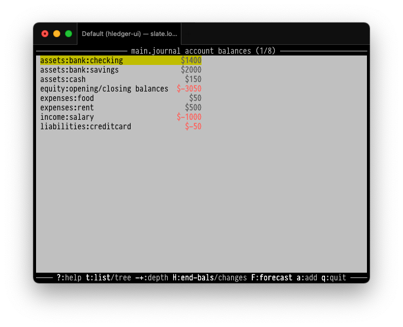
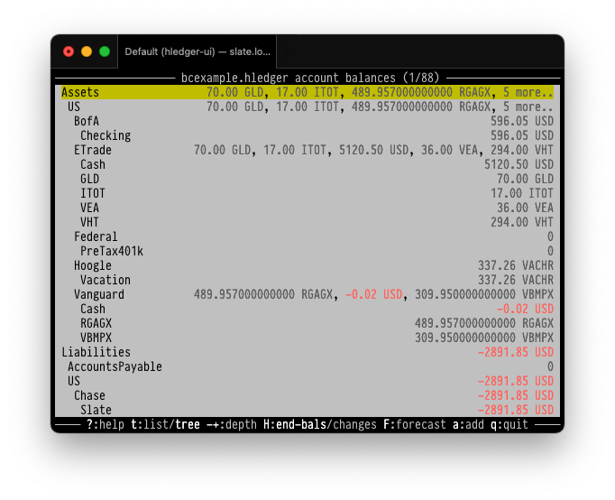
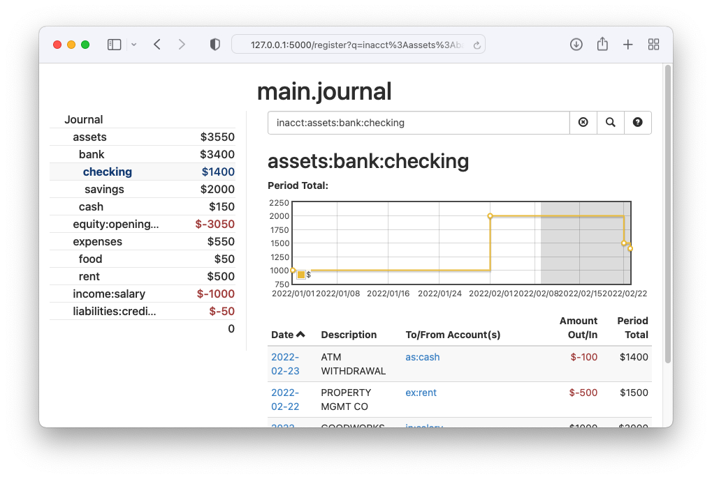

# 2 minute quick start

One of the introductions to hledger; for others, see [Get Started](start.md).

Here is a sequence of examples, focussed on command-line usage:

```shell
$ brew install hledger    # or apt, choco, but check Install for freshness
```
```shell
$ cat >main.journal    # record a transaction manually from command line
2022-01-01 opening balances as of this date
    assets:bank:checking                $1000
    assets:bank:savings                 $2000
    assets:cash                          $100
    liabilities:creditcard               $-50
    equity:opening/closing balances
^D
```
```shell
$ export LEDGER_FILE=main.journal    # use this file by default
$ echo 'export LEDGER_FILE=main.journal' >>~/.profile    # and in future sessions
```
```shell
$ hledger add    # record a transaction interactively
Adding transactions to journal file main.journal
Any command line arguments will be used as defaults.
Use tab key to complete, readline keys to edit, enter to accept defaults.
An optional (CODE) may follow transaction dates.
An optional ; COMMENT may follow descriptions or amounts.
If you make a mistake, enter < at any prompt to go one step backward.
To end a transaction, enter . when prompted.
To quit, enter . at a date prompt or press control-d or control-c.
Date [2022-02-08]: 2/15
Description: market
Account 1: expenses:food
Amount  1: $50
Account 2: assets:cash
Amount  2 [$-50]: 
Account 3 (or . or enter to finish this transaction): 
2022-02-15 market
    expenses:food             $50
    assets:cash              $-50

Save this transaction to the journal ? [y]: 
Saved.
Starting the next transaction (. or ctrl-D/ctrl-C to quit)
Date [2022-02-15]: 
```
```shell
$ hledger stats    # show journal statistics
Main file                : main.journal
Included files           : 
Transactions span        : 2022-01-01 to 2022-02-16 (46 days)
Last transaction         : 2022-02-15 (7 days from now)
Transactions             : 2 (0.0 per day)
Transactions last 30 days: 0 (0.0 per day)
Transactions last 7 days : 0 (0.0 per day)
Payees/descriptions      : 1
Accounts                 : 6 (depth 3)
Commodities              : 1 ($)
Market prices            : 0 ()

Run time (throughput)    : 0.04s (47 txns/s)
```
```shell
$ hledger bal --monthly    # show account balance changes each month
Balance changes in 2022-01-01..2022-02-28:

                                 ||    Jan   Feb 
=================================++==============
 assets:bank:checking            ||  $1000     0 
 assets:bank:savings             ||  $2000     0 
 assets:cash                     ||   $100  $-50 
 equity:opening/closing balances || $-3050     0 
 expenses:food                   ||      0   $50 
 liabilities:creditcard          ||   $-50     0 
---------------------------------++--------------
                                 ||      0     0 
```
```shell
$ cat >checking.csv    # make some CSV data, as if downloaded from a bank
"Date","Note","Amount"
"2022/2/01","GOODWORKS CORP","-1000.00"
"2022/2/22","PROPERTY MGMT CO","500.00"
"2022/2/23","ATM WITHDRAWAL","-100.00"
^D
```
```shell
$ cat >checking.csv.rules    # and a rules file to help hledger read it
skip 1
fields date, description, amount
account1 assets:bank:checking
currency $
amount   -%amount

if GOODWORKS
 account2 income:salary

if PROPERTY
 account2 expenses:rent

if ATM WITHDRAWAL
 account2 assets:cash
^D
```
```shell
$ hledger import checking.csv    # import CSV records as new journal entries
imported 2 new transactions from checking.csv
$ hledger import checking.csv    # records already seen are ignored; cf --dry-run
no new transactions found in checking.csv
```
```shell
$ hledger print date:202202   # show transactions in february
2022-02-01 GOODWORKS CORP
    assets:bank:checking           $1000
    income:salary                 $-1000

2022-02-15 market
    expenses:food             $50
    assets:cash              $-50

2022-02-22 PROPERTY MGMT CO
    assets:bank:checking           $-500
    expenses:rent                   $500

2022-02-23 ATM WITHDRAWAL
    assets:bank:checking           $-100
    assets:cash                     $100

```
```shell
$ hledger is -M    # show a monthly income statement (profit & loss report)
Income Statement 2022-01-01..2022-02-28

               || Jan    Feb 
===============++============
 Revenues      ||            
---------------++------------
 income:salary ||   0  $1000 
---------------++------------
               ||   0  $1000 
===============++============
 Expenses      ||            
---------------++------------
 expenses:food ||   0    $50 
 expenses:rent ||   0   $500 
---------------++------------
               ||   0   $550 
===============++============
 Net:          ||   0   $450 
```
```shell
$ hledger bs -M --tree    # show monthly asset and liability balances
Balance Sheet 2022-01-31..2022-02-28

                        || 2022-01-31  2022-02-28 
========================++========================
 Assets                 ||                        
------------------------++------------------------
 assets                 ||      $3100       $3550 
   bank                 ||      $3000       $3400 
     checking           ||      $1000       $1400 
     savings            ||      $2000       $2000 
   cash                 ||       $100        $150 
------------------------++------------------------
                        ||      $3100       $3550 
========================++========================
 Liabilities            ||                        
------------------------++------------------------
 liabilities:creditcard ||        $50         $50 
------------------------++------------------------
                        ||        $50         $50 
========================++========================
 Net:                   ||      $3050       $3500 
```
```shell
$ hledger areg checking    # show checking's transactions and running balance
Transactions in assets:bank:checking and subaccounts:
2022-01-01 opening balances    as:ba:savings, as..         $1000         $1000
2022-02-01 GOODWORKS CORP      in:salary                   $1000         $2000
2022-02-22 PROPERTY MGMT CO    ex:rent                     $-500         $1500
2022-02-23 ATM WITHDRAWAL      as:cash                     $-100         $1400
```
```shell
$ hledger-ui --forecast   # start the terminal UI (except on Windows)
```



```shell
$ hledger-ui --tree -f examples/bcexample.hledger   # a multicurrency journal
```


```shell
$ hledger-web    # start the web UI
```



```shell
$ hledger-web -f examples/bcexample.hledger    # from data by Martin Blais
```


<!--
What is planned for hledger ?

More support for investing,
more support for correctness and accounting/business rules,
more input/output formats,
more speed,
more GUI,
charts,
better getting started experience.
See also [ROADMAP](ROADMAP.md).
-->
