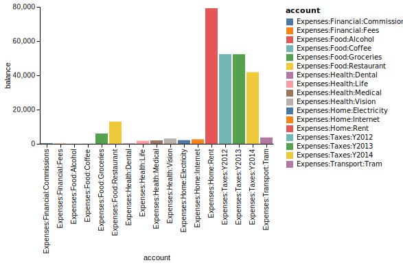
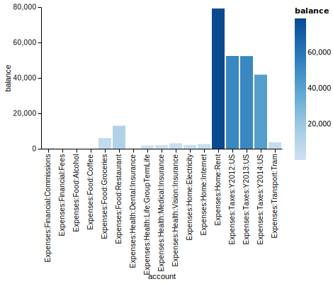

# Charts and Graphs

<div class=pagetoc>

<!-- toc -->
</div>

Tips and techniques for producing graphical charts from hledger data.

The most common general approach is to produce simple [CSV output](hledger.md#output-format) from a report - usually the balance report with -N/--no-total and --layout=bare:
```
hledger bal expenses -N --layout bare -o report.csv
```
and then use one of the many ways to make charts from CSV data.

## Charting tools built for hledger

Simplest first:

### hledger-bar

[hledger-bar](scripts.md#hledger-bar) (2023)
is a bash script for making quick bar charts in the terminal.

```
$ hledger bar someacct
2023-01	+++++
2023-02	++++
2023-03	++++
2023-04	+
```

```
$ hledger bar -- -v 1 -f $TIMELOG biz
2023-01	        15 +++++++++++++++
2023-02	        10 ++++++++++
2023-03	        20 ++++++++++++++++++++
2023-04	        12 ++++++++++++
```

```
$ hledger bar -- -v 1 -f $TIMELOG biz -p weeklyfrom3weeksago
2023-03-27W13	         8 ++++++++
2023-04-03W14	         2 ++
2023-04-10W15	         4 ++++
2023-04-17W16	         5 +++++
```

### hledger-plot

[hledger-plot](https://pypi.org/project/hledger-utils) (2023)
is a powerful graphical chart-making tool written in python.

### hledger-sankey

- <https://github.com/adept/hledger-sankey> A python3 script (that uses pandas and plotly) to plot three sankey graphs of hledger data
- <https://github.com/JustSaX/hledger-sankey> hledger-sankey made interactive with Streamlit
### hledger-vega

[hledger-vega](https://github.com/xitian9/hledger-vega) (2022) is a set of scripts for producing custom charts
from your hledger reports, using the powerful [vega-lite](https://vega.github.io/vega-lite/).
It works best with hledger 1.25+. 
<!-- <https://nest.pijul.com/simonmichael/hledger-vega> is another variant -->


### r-ledger

[r-ledger](https://github.com/trevorld/r-ledger) is an R package for making reports and charts from hledger, Ledger or Beancount.

## Other tools

### Spreadsheets

Drag the CSV file into your favourite spreadsheet app and use its interactive charting tools.

### Ledger chart tools

Tools built for Ledger or other PTA apps can sometimes be adapted to work with hledger also; or, hledger data can be exported to be read by Ledger. 

- [These simple bash scripts](https://www.sundialdreams.com/report-scripts-for-ledger-cli-with-gnuplot/) (2016) generate GNUplot charts from Ledger.
- [ledger-plots](https://github.com/esovetkin/ledger-plots) (2018) is an R package for making charts from Ledger.
- [ledger-plot](https://github.com/Tagirijus/ledger-plot) (2019) is a python script for making GNUplot charts from Ledger.

### ploterific

[ploterific](https://github.com/GregorySchwartz/ploterific) (`stack install hvega-theme ploterific`) produces simple charts,
in a HTML file that uses the [Vega-Lite](https://vega.github.io/vega-lite/) javascript library.
Charts can also be saved as SVG or PNG. An example:

```
hledger -f examples/bcexample.hledger bal -O csv -N expenses -3 cur:USD \
    | sed 's/ USD//' \
    | ploterific -m Bar -f account:N -f balance:Q -c account -o a.html \
    && open a.html
```


Let's break down that command line:

- `-f examples/bcexample.hledger` - use this example file in the hledger repo. Omit this to use your default journal.
- `bal` - run a [balance report](hledger.md#balance)
- `-O csv` - show it as [CSV](hledger.md#output-format) on stdout
- `-N` - disable the final Total row
- `expenses` - [limit](hledger.md#queries) to accounts whose name contains `expenses`
- `-3` - summarise accounts to [depth](hledger.md#depth) 3 and above
- `cur:USD` - limit to balances in `USD` currency. If you use the `$` symbol, it would be `cur:\\$`.
- `sed 's/ USD//g'` - process the output with [sed](https://www.gnu.org/software/sed/), stripping the ` USD` symbols to leave bare numbers for ploterific. With `$` it would be `sed 's/\$//g'`.
- `-m Bar` - use `Bar` as the Vega-Lite [mark type](https://hackage.haskell.org/package/hvega-0.11.0.1/docs/Graphics-Vega-VegaLite.html#t:Mark)
- `-f account:N` - use the `account` column as the first feature (X axis), treating values as names
- `-f balance:Q` - use the `balance` column as a second feature (Y axis), treating values as quantities
- `-c account` - use `account` values to select colours
- `-o a.html` - save into a temporary HTML file
- `&& open a.html` - and view it in your web browser, on Mac; on other systems it might be `xdg-open` or `start`

Here is the same chart but with the colour set by the balance:

```
hledger -f examples/bcexample.hledger bal -O csv -N expenses -3 cur:USD \
    | sed 's/ USD//' \
    | ploterific -m Bar -f account:N -f balance:Q -c balance:Q -o a.html
```


### SankeyMATIC

- <https://sankeymatic.com> make sankey diagrams in your browser

The format is `Source [Amount] Target`. A rough script that exports the outflows from several asset accounts:

```cli
LEDGER_FILE=examples/sample.journal
for f in checking saving cash; do 
  hledger areg $f -O tsv | tail +2 | sed -e "s/^/$f\t/"
done | cut -f1,6,7 | gsed -E -e 's/\$//' -e 's/([^\t]*)\t([^\t]*)\t([^\t]*)/\1 [\3] \2/' | grep '\[-' | gsed 's/\[-/[/'
```
